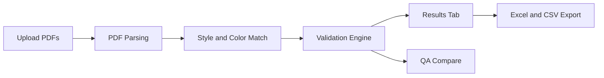

# System Documentation (Developer)

Short reference for developers who need to install, run, debug, and extend this project.

## 1. Purpose

The app automates BOM validation:
1. Parse BOM PDF files.
2. Match parsed data with Excel/CSV rows.
3. Validate in quick or full mode.
4. Export results.
5. Run QA comparison between files.

## 2. Install And Run

### Do You Need To Install A PDF Parser Separately?

No separate manual install is needed in normal setup.

- The PDF parser libraries are already included in [requirements.txt](requirements.txt):
  - `pdfplumber`
  - `PyMuPDF`
  - `tabula-py`
  - `camelot-py`

Install command:

```powershell
pip install -r requirements.txt
```

Only install extra system tools if needed:
- Java: for `tabula-py` code paths
- Ghostscript: for `camelot-py` lattice code paths

### Required Dependencies (Run)

- Python 3.11+
- pip
- Packages from [requirements.txt](requirements.txt)

### Optional Dependencies (Some PDF Parsing Cases)

- Java Runtime (JRE/JDK 11+): needed if `tabula-py` paths are used.
- Ghostscript: needed if `camelot-py` lattice extraction is used.

If Java or Ghostscript is missing, core app features may still run, but specific PDF table extraction paths can fail.

### Debug Setup (Recommended)

- VS Code Python extension
- Select project venv interpreter (`.venv`)
- Launch Streamlit from terminal, then attach/debug Python as needed

### Local (Windows PowerShell)

```powershell
python -m venv .venv
.\.venv\Scripts\Activate.ps1
pip install -r requirements.txt
streamlit run bom_automation/app.py
```

App URL: http://localhost:8501

### Docker

```powershell
docker build -t trim-automation .
docker run --rm -p 8501:8501 trim-automation
```

### First-Time Setup Checklist (New Developer)

1. Install Python 3.11+.
2. Create and activate virtual environment.
3. Run `pip install -r requirements.txt`.
4. Start app with `streamlit run bom_automation/app.py`.
5. If parser errors mention Java or Ghostscript, install missing tool and restart terminal.

## 3. Simple System Flow



## 4. Code Map (Where To Edit)

- `bom_automation/app.py`: app entrypoint and tab wiring.
- `bom_automation/tabs/pdf_tab.py`: upload, dedupe, parse trigger.
- `bom_automation/tabs/compare_tab.py`: file mapping, mode selection, run validation.
- `bom_automation/tabs/results_tab.py`: summary UI and download actions.
- `bom_automation/tabs/qa_tab.py`: expected vs actual comparison logic.
- `bom_automation/parsers/pdf_parser.py`: PDF section detection and metadata extraction.
- `bom_automation/validators/matcher.py`: style and color matching behavior.
- `bom_automation/validators/filler.py`: fill fields and set validation status.
- `bom_automation/exporters/excel_exporter.py`: Excel formatting and output layout.

## 5. Validation Modes

- Quick Trim (Planning): fast output set.
- Trim (Purchasing): full output set using per-style settings.

Main run path is inside `bom_automation/tabs/compare_tab.py` and calls `validate_and_fill` from `bom_automation/validators/filler.py`.

## 6. Important Session State Keys

- `bom_dict`: parsed BOM data by style.
- `pdf_hashes`: track upload changes and duplicates.
- `label_selections`: per-style config for full mode.
- `comparison_raw`: uploaded comparison DataFrame.
- `validation_result`: final output DataFrame.
- `validation_mode`: active mode label.

If a tab looks empty or wrong, check these keys first.

## 7. Developer Quick Checks

1. Upload two PDFs in PDF tab.
2. Upload one comparison file in Comparison tab.
3. Run both validation modes.
4. Confirm rows appear in Results tab.
5. Export Excel and CSV and verify files open.
6. Run QA compare with a known expected file.

## 8. Common Problems

- No BOM matched: style in comparison file does not match style from PDF metadata.
- High error count: wrong style/color column mapping.
- Missing data after refresh: Streamlit session reset.
- Parser dependency error:
  - `Java not found` -> install Java and restart terminal.
  - `Ghostscript not found` -> install Ghostscript and restart terminal.
